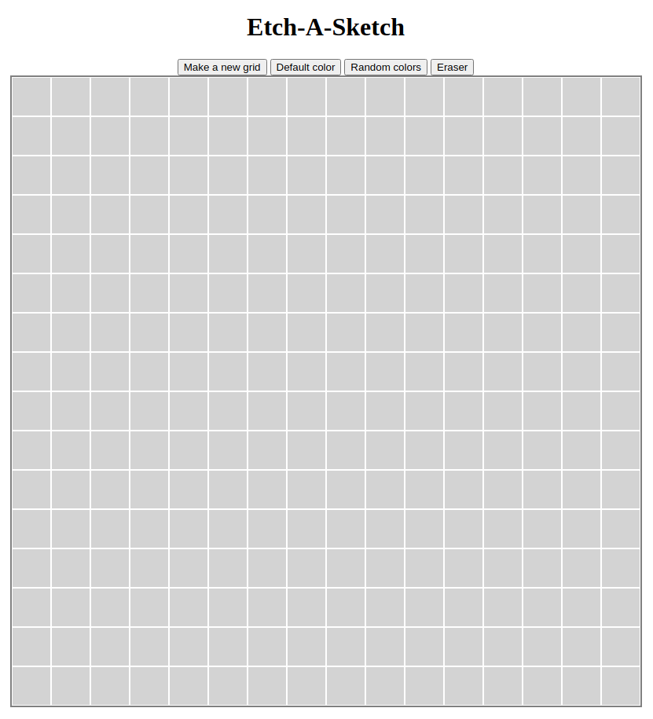

# Etch-A-Sketch

## Links
* <a href="https://rawcdn.githack.com/lhtn/etch-a-sketch/ca8e211b968a3ae058c885c89a0a7bd91958f2ec/index.html">Live demo</a>
* <a href="https://www.theodinproject.com/lessons/foundations-etch-a-sketch">Link to the assignment</a>

## About
This is the Etch-A-Sketch program from the Odin Project. I learned about CSS Grid and practiced using EventListeners.

# Built with
* HTML
* CSS
* JavaScript